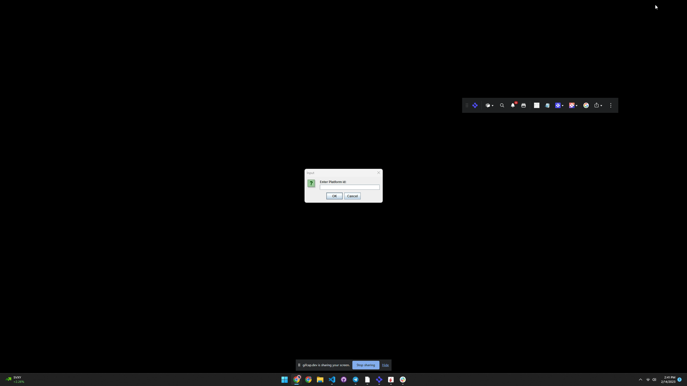

# How to Interop with a Workspace Platform

This example connects three native applications to a workspace platform. The implementation of the workspace platform is on our workspace starter repo: <https://github.com/built-on-openfin/workspace-starter/tree/main/how-to/workspace-platform-starter>.

It shows how a native application and a workspace platform could work together so that the native applications could provide a list of apps to a platform and provide information so that the native application can be part of a saved workspace.

## Launch Steps

- Launch workspace-platform-starter from the workspace-starter repo. This will launch the workspace platform and the native applications.

- Start Java-Starter from this repo. This will launch the Java application.

- Enter 'workspace-platform-starter' into the Platform id prompt. This will connect the Java application to the workspace platform (The platform id can be found in the manifest of the starter project) or pass the workspace platform id using the command line.


The launched application will allow you to launch native windows and listen/transmit context(ticker symbols) to the workspace platform.


## Context Sharing

- Selecting channel to listen to will allow you to listen to context from the workspace platform. The context will be displayed in the text box.

Context Channel joined by calling joinAllGroups (Interop.java):

```java
    public void joinAllGroups(String color, JavaTest JT) {
     CompletableFuture<Context> listenerInvokedFuture = new CompletableFuture<>();
     javaTest = JT;
     desktopConnection.getInterop().connect(platformId).thenCompose(client->{
      return client.getContextGroups().thenCompose(groups->{
       return client.joinContextGroup(color).thenCompose(v->{
        return client.addContextListener(ctx->{
         System.out.print(color + ctx.getId());
         JT.updateTicker(ctx.getId());
         listenerInvokedFuture.complete(ctx);
        });
       });
      });
     });
    }
 ```

- Selecting channel to transmit to will allow you to transmit context to the workspace platform by setting ticker symbol from dropdown.

 ```java
public void clientSetContext(String group, String ticker, String platformName) throws Exception {
  Context context = new Context();
  JSONObject contextId = new JSONObject();
  contextId.put("ticker", ticker);
  context.setId(contextId);
  var name = "Unknown";
  if(ticker.equals("AAPL")) {
   name = "Apple Inc.";
  } else if(ticker.equals("MSFT")) {
   name = "Microsoft Corporation";
  } else if(ticker.equals("GOOGL")) {
   name = "Alphabet Inc.";
  } else if(ticker.equals("TSLA")) {
   name = "Tesla Inc.";
  }
  context.setName(name);
  context.setType("fdc3.instrument");
  CompletionStage<Void> setContextFuture = desktopConnection.getInterop().connect(platformName)
    .thenCompose(client -> {
     return client.getContextGroups().thenCompose(groups -> {
      return client.joinContextGroup(group).thenCompose(v -> {
       return client.setContext(context);
      });
     });
    });

  setContextFuture.toCompletableFuture().get(10, TimeUnit.SECONDS);
 }
```

 
