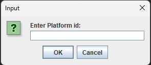

# How to Save Native apps with a Workspace Platform

The implementation of the workspace platform is on our workspace starter repo: <https://github.com/built-on-openfin/workspace-starter/tree/main/how-to/workspace-platform-starter>.

It shows how a native application and a workspace platform could work together so that the native applications could provide a list of apps to a platform and provide information so that the native application can be part of a saved workspace.

## Launch Steps

- Launch workspace-platform-starter from the workspace-starter repo. This will launch the workspace platform and the native applications.

- Start Java-Starter from this repo. This will launch the Java application.

- Enter 'workspace-platform-starter' into the Platform id prompt. This will connect the Java application to the workspace platform (The platform id can be found in the manifest of the starter project) or pass the workspace platform id using the command line.



The launched application will allow you to launch native windows and listen/transmit context(ticker symbols) to the workspace platform.


## Native App Integration from Home

- Upon workspace save being called from workspace-platform-starter, it queries java project for a document representing open apps and their location.

### Java Project Responds with xml (Interop.java)

```java
    public JSONObject getSnapshot() {
```

### Java Project Launches Apps sent back from workspace-platform-starter (Interop.java)

```java
    public void applySnapshot(JSONObject snapshot) {
```

## Documentation

<https://cdn.openfin.co/docs/java/latest/com/openfin/desktop/snapshot/SnapshotSourceProvider.html>
