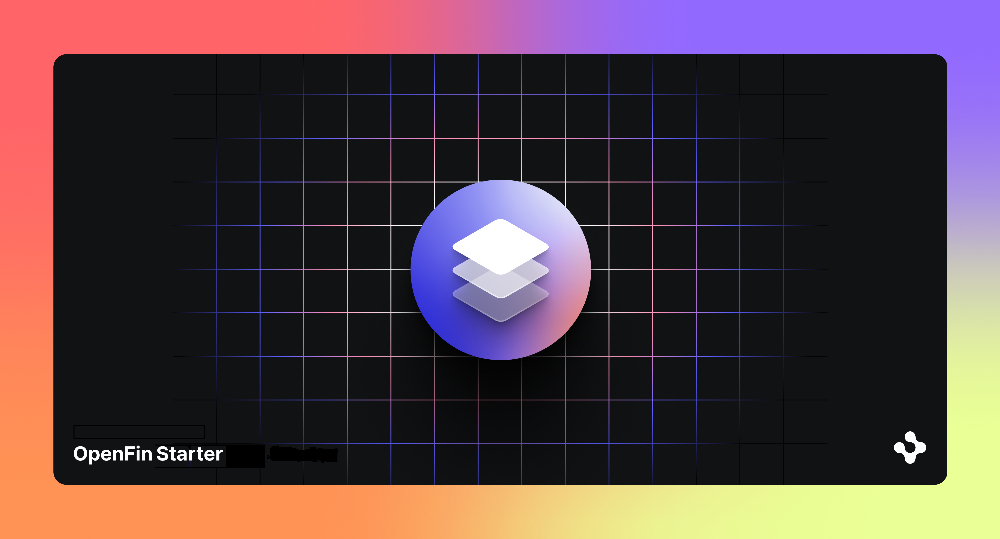

> **_:information_source: OpenFin Node Adapter:_** [OpenFin Node Adapter](https://www.openfin.co/workspace/) is a commercial product and this repo is for evaluation purposes. Use of the OpenFin Node Adapter, OpenFin Container and OpenFin Workspace components is only granted pursuant to a license from OpenFin. Please [**contact us**](https://www.openfin.co/workspace/poc/) if you would like to request a developer evaluation key or to discuss a production license.

## Learning more about Node, Interop and FDC3

This example shows how you can use the node adapter to connect to a platform's interop broker to share or receive context and intents on a user channel.

## Node App

The node app itself is command line driven. It does not contain a UI. The app performs the following functions:

- Connects to the Workspace Platform Starter instance (please ensure that this is running prior to running this example).
- Connects to the green channel in the Workspace Platform Starter platform.
- Creates two listeners, one each for a published context and intent, originating from the Workspace PLatform Starter.
- Based on the command line argument passed in, this app will either publish a fdc3.Contact context or fire a ViewContact intent or fire a ViewContact intent with a specific app (participant-summary-view) as a target.

### Building the Node App

> **_:information_source: Node version used:_** This sample was built and tested against node v20.9.0.

The node app project can be found in [server/src/index.ts](./server/src/index.ts).

The node app is built with the command: npm run build.

The node app is started with the command: npm run server <context/intent>.

## Build the Platform and Node application

1. Ensure that you are in the sub-folder that contains the package.json file.

2. Run

   ```bash
   npm run setup
   ```

   to install the dependencies

3. Run

   ```bash
   npm run build
   ```

   to build the client component.

   - **Note**. Please remember to repeat steps 1 though 3 each time you modify the code.

4. Open a new Terminal / Command Window in the same sub-folder as step 1. Run

   ```bash
   // share contact context
   npm run server context
   OR
   // raise a ViewContact intent with contact context
   npm run server intent
   OR
   // raise a ViewContact intent with contact context specifying target app participant-summary-view
   npm run server intentWithTarget
   ```

   to run the node app.

## Workspace Platform Starter Modifications

In order to test firing intents from within the Workspace Platform Starter app that are received by the node app, you will need to modify the apps.json file in the Workspace Platform Starter (public\common\apps.json). Please copy and paste the following text into that file, as the first element in the array at the top:

```json
{
  "appId": "node-app",
  "name": "node-app",
  "title": "Node JS app",
  "description": "A Node JS app that connects to WOrkspace via the node adapter and performs interop.",
  "manifest": <fully qualified path name of the node app>,
  "manifestType": "external",
  "private": true,
     "autostart": false,
  "instanceMode": "single",
  "icons": [
   {
    "src": "http://localhost:8080/common/images/icon-blue.png"
   }
  ],
  "contactEmail": "contact@example.com",
  "supportEmail": "support@example.com",
  "publisher": "OpenFin",
  "intents": [
   {
    "name": "ViewContact",
    "displayName": "View Contact",
    "contexts": ["fdc3.contact"]
   }
  ],
  "images": [],
  "tags": []
 }
```

### Note about "manifest" in the snippet above

For the manifest, please provide the fully qualified path name of the location of the node app. Alternately you can also provide the name of a batch file that will execute the node app. If you provide the path to the node app then please ensure that you provide the correct amount of command line arguments. Please see the section above named "command line arguments" below.

## Command line arguments

At least one command line argument must be passed in. This excludes the 3 arguments necessary to start the app itself.

1. npm run server context - If "context" is passed in then the app will start up as described above and publish an fdc3.Contact context. You can view the results of this context in the Workspace Starter Platform by opening the FDC3 Context Viewer app and joining the green channel. You can use the FDC3 Context Viewer app in the Workspace Platform Starter to publish a context which should then be picked up by the Node app and displayed in the terminal window.

2. npm run server intent - If "intent" is passed in then the app will start up as described above and fire a ViewContact intent. You will see the Workspace Platform Starter display the intent picker UI. If you pick one of the apps (eg. Client Overview) you will see the information for the context that came is as part of the intent from the node app. Please see the next section that shows how to set up the Workspace Platform Starter to publish intents to the Node app.

3. npm run server intentWithTarget - If "intentWithTarget" is passed in then the app will start up as described above and fire a ViewContact intent specifying a target app with appId participant-summary-view. You will not see the Workspace Platform Starter display the intent picker UI but it will launch the participant summary app with the Avi Green contact context. Please see the next section that shows how to set up the Workspace Platform Starter to publish intents to the Node app.

### Testing that intents fired from Workspace Platform Starter are received by the Node app

- Ensure that you have the Workspace Platform Starter app running.

  Link to the Workspace Platform Starter sample code: <https://github.com/built-on-openfin/workspace-starter/tree/main/how-to/workspace-platform-starter>

  Link to the live example of Workspace Platform Starter: <https://github.com/built-on-openfin/workspace-starter?#readme>
  Scroll down to the where all the examples are listed. The second example says "Workspace Platform Starter" Click on the link named "Example 1". This will attempt to start the example live, without you needing to download and build the code. Please follow the prompts and wait until you see the Dock and the Home screen appear. Your app is now running.

- Ensure that you have the node app running, by executing one of the two command line options mentioned in the section "Node App" above.

- Open up the "Participant Selection" sample app in the Workspace Platform Starter platform.

- Click the "Fire Intent" button and you will see the intent picker UI open.

- Select the "Node JS App" from the drop down list and click "Launch".

- You will see the "fdc3.contact" text and the contact name appear in the terminal window of the Node app.

> **_:warning: A Note about Node:_** Node 17 changed their behavior and "localhost" favours IPv6 when it used to favour IPv4. This would cause your node-adapter connection to fail. Node 20+ has been updated and this is no longer and issue. Our example runs some code to set the preference to IPv4 in the [provider.ts](./server/src/index.ts) file. If you are using node 20 and above or 16 or below then this try/catch logic can be removed if you want. More information can be found [here](https://github.com/nodejs/node/issues/40537).

## APIs

The **node adapter** does not have an FDC3 API but you can connect to an Interop Broker and receive an interop client. As you can see from this example FDC3 and the Interop API work together.

The **provider** does not have an FDC3 API and it doesn't have a fin.me.interop API enabled. You can however assign an interop client to fin.me.interop once your platform (and the broker) is initialized. In this example we are connecting to the interop broker of the Workspace Platform Starter.

**Windows and Views** can use the FDC3 API (like you can see in our FDC3 Context Window) if they opt for it through the manifest by specifying fdc3InteropApi and a giving it a version e.g. "2.0" as part of default View Options or default Window Options. Or as shown in the example you can opt into FDC3 when launching the Window by specifying fdc3InteropApi as part of the Window Options.
