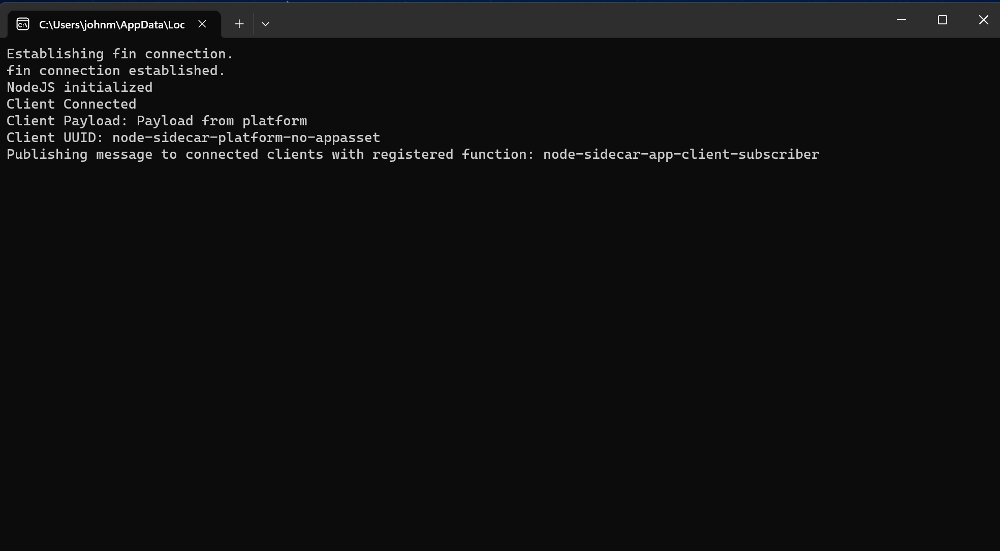

> **_:information_source: OpenFin Node Adapter:_** [OpenFin Node Adapter](https://www.openfin.co/workspace/) is a commercial product and this repo is for evaluation purposes. Use of the OpenFin Node Adapter, OpenFin Container and OpenFin Workspace components is only granted pursuant to a license from OpenFin. Please [**contact us**](https://www.openfin.co/workspace/poc/) if you would like to request a developer evaluation key or to discuss a production license.

## Please Note

> **_:warning: App Asset & Launch External Process:_** Using app assets and launch external process is a trade off and it is important to balance the pros and the cons. The pro is that an app asset can be used to provide enhanced capabilities to your application. The cons to consider is that it will make your deployments harder. OpenFin has a very streamlined deployment process that makes deploying and upgrading easy. When you introduce an app asset you do have the ability to download and update your app asset but your client needs to be happy with allowing zips containing a binary to be downloaded and to permission the APIs download app asset and launch external process.

## Learning more about App Assets & Launch External Process

We have a hints and tips article that covers more details about app assets and launch external process. It covers the reasons why you might want to use it, how it works and what you should consider:

- [App Assets and Launch External Process](https://github.com/built-on-openfin/workspace-starter/blob/main/how-to/hints-and-tips/docs/appassets-and-launch-external-process.md)

> **_:information_source: Notes about the packages used:_** We use various packages in this example such as "pkg" and "bestzip". These packages are used purely for example purposes to pack the node application into an exe and zip it as an app asset. The use of these packages should not be considered as a recommendation and you should use your own criteria when deciding what packages to use.

## Native SideCar App

This is a very basic example of a platform app being launched that has a native app as a dependency.

The SideCar Application in this case is a Node application that:

- Allows messages to be sent to it (it echos the message back)
- Publishes a message to all connected clients (it sends it to all connected clients 10 seconds after a client connects)

### SideCar App UI



> **_:information_source: Node version used:_** This sample was built and tested against node v16.19.1.

The SideCar App is a Node App which is visible when launched. It logs messages to the console so that you can see how it interacts with the host app.

When the platform launches the SideCar App it tries to connect to this service and waits. The node app creates the service shortly after connecting to the OpenFin runtime.

When a client connects it uses the publish api to send a message to all connected clients that have the registered function meant to receive the message.

The SideCar App will close when the Platform App is closed as we link it to the lifetime of the Platform when it is launched via Launch External Process.

The SideCar App project can be found in [server/src/index.ts](./server/src/index.ts).

The SideCar is built when npm run build is run. The node app can be packaged into an exe, zipped and placed in the assets directory [public/assets/sidecar-app.zip](./public/assets/sidecar-app.zip) when the command npm run pack is issued.

## SideCar Platform App

The Platform app is very basic. It fetches the SideCar App, launches it and tries to connect to the it. It registers a function that can be called by the SideCar App and gives the option of calling a function on the SideCar App.

### SideCar Platform App UI


The SideCar Platform App has two manifests:

- [manifest.fin.json](./platform/public/manifest.fin.json) - this manifest includes the permissions you need in order to download an app asset and launch it. This manifest **does not** include an AppAsset definition and the sample will fetch the AppAsset through code written in the provider [provider.ts](./platform/client/src/provider.ts). **if you change the code remember to bump up the version number in the app asset definition**.

- [second.manifest.json](./platform/public/second.manifest.fin.json) - this manifest includes the permissions you need in order to download an app asset and launch it. This manifest **does** include an AppAsset definition so the RVM will automatically download the AppAsset before the platform is launched. **if you change the code remember to bump up the version number in the app asset definition in the manifest**.

The buttons perform the following functions:

- Connect To SideCar App - This button checks to see if an AppAsset has been defined in the manifest. If it has it means the RVM has fetched the asset already, otherwise it defines an AppAsset and downloads it using the OpenFin API. It will then launch the asset through the LaunchExternalProcess API and connects to it using our Channel API (once the native app is launched you need to click the create service button for it to connect).
- Dispatch Message To SideCar App - The platform app uses the client connection to the SideCar App to send a message and receive a response from the SideCar App.
- Clear Logs - simply clears the panel to make it easier to see status messages.

## Build the Platform and Native application

1. Ensure that you are in the sub-folder that contains the code.

2. Run

   ```bash
   npm run setup
   ```

   to install the dependencies

3. Run

   ```bash
   npm run build
   ```

   to build the client component.

   - **Note**. Please remember to repeat steps 1 though 3 each time you modify the code.

4. Run

   ```bash
   npm run pack
   ```

   To package up the nodejs app output located in the server/build directory.

5. Run

   ```bash
   npm run start
   ```

   to start the generic http server that will serve static files.

6. Open a new Terminal / Command Window in the same sub-folder as step 1. Run

   ```bash
   npm run client
   ```

   to run the client component.

## Testing end to end process flow

To go through the flow you can run client (step 5 above).

You can then use the Platform UI to trigger the following flow:


> **_:warning: A Note about Node:_** Node 17 changed their behavior and "localhost" favours IPv6 when it used to favour IPv4. This would cause your node-adapter connection to fail. Node 20+ has been updated and this is no longer and issue. Our example runs some code to set the preference to IPv4 in the [provider.ts](./server/src/index.ts) file. If you are using node 20 and above or 16 or below then this try/catch logic can be removed if you want. More information can be found [here](https://github.com/nodejs/node/issues/40537).
